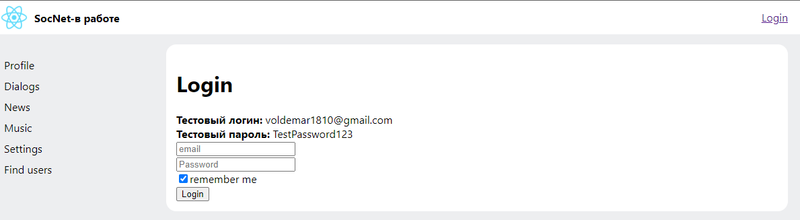
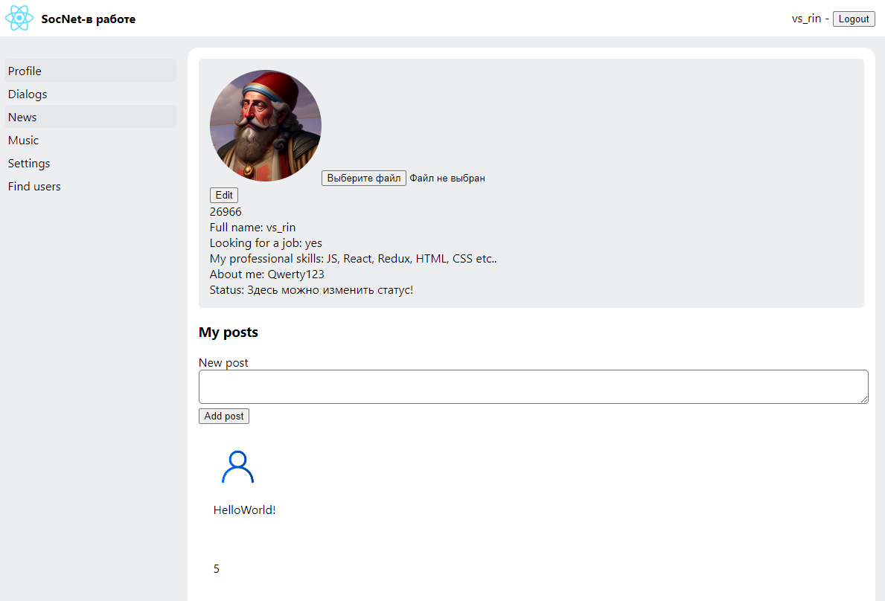
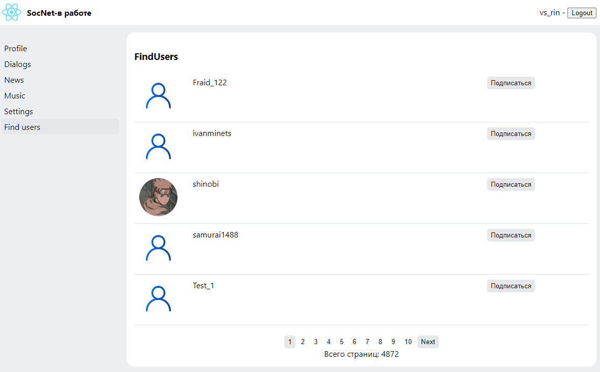

# Social network

Учебный проект. Позволяет регистрироваться, получать доступ к списку пользователей социальной сети, редактировать профиль. В планах разработка ведения переписки, перевод всего проекта на TS.

Ссылка на прод: https://social-network-bice-sigma.vercel.app/

Стек: JavaScript, TypeScript, ReactJS, React Router, Redux, Redux-Toolkit, HTML, CSS

# Скриншоты

